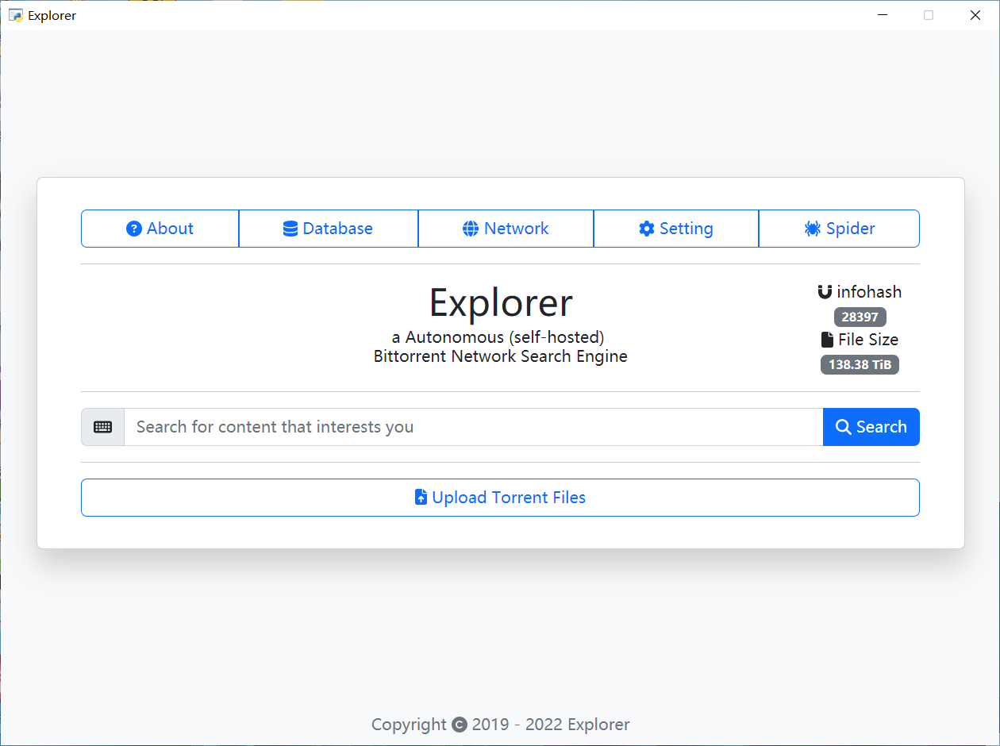
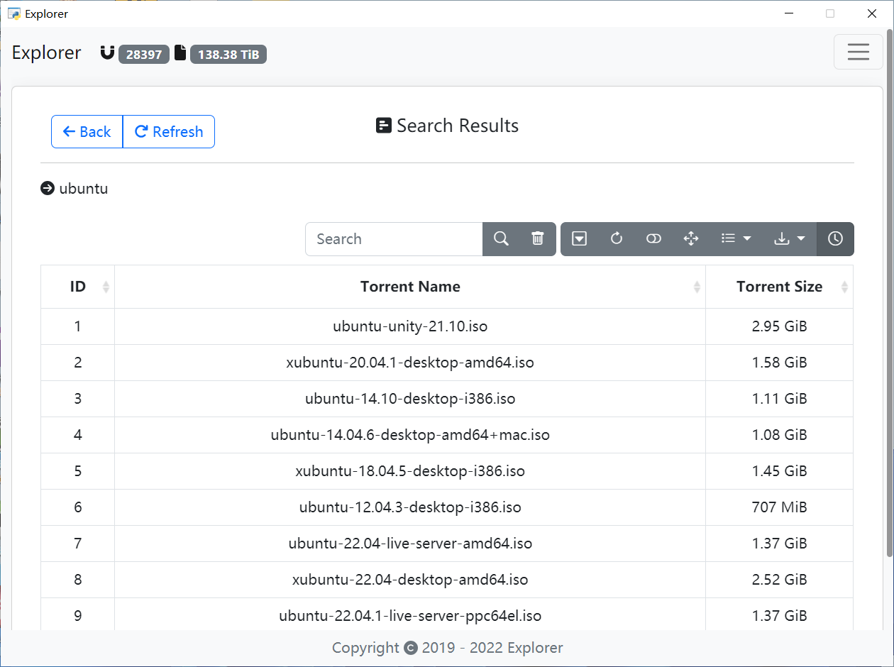
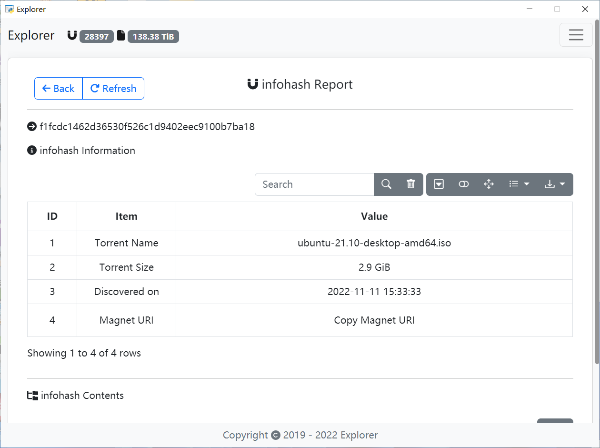

  <h1 align="center">
    
      Explorer
    
  </h1>
  <h4 align="center">
    
      a Autonomous (self-hosted)
    
     
    
      Bittorrent Network Search Engine
    
  </h4>

  
  

## About the repository

### Introduction

Explorer is a Autonomous (self-hosted) Bittorrent Network Search Engine, it sniffs torrents that people are using to download movies, music, documents, games and so on from Bittorrent Network.

A torrent has valuable information, so you can use Explorer to build your own torrent database, or to do data mining and analyzing.

### Requirements

* A Host with public or private IP that can connect to the Internet
* Allow UDP traffic get through firewall
* Your ISP allows Bittorrent traffic

### Supported protocols

|  Number  |               Protocol Name                |
| :------: | :----------------------------------------: |
| BEP 0005 |                DHT Protocol                |
| BEP 0007 |           IPv6 Tracker Extension           |
| BEP 0009 | Extension for Peers to Send Metadata Files |
| BEP 0010 |             Extension Protocol             |
| BEP 0015 |    UDP Tracker Protocol for BitTorrent     |
| BEP 0020 |            Peer ID Conventions             |
| BEP 0023 |     Tracker Returns Compact Peer Lists     |
| BEP 0032 |     BitTorrent DHT Extensions for IPv6     |
| BEP 0042 |           DHT Security Extension           |
| BEP 0048 |     Tracker Protocol Extension: Scrape     |
| BEP 0051 |           DHT Infohash Indexing            |

### Supported languages

The repository is translated from English to several languages. I would be glad if you add new translations. You can translate the repository to your native language with Google.

language files folder in the ./explorer_web_server/languages

* en-GB
* en-US
* zh-CN
* zh-HK
* zh-SG
* zh-TW

### Screenshots

|  |  |  |
| :----------------------------------------: | :---------------------------------------: | :---------------------------------------: |
|                  default                   |                  search                   |                  report                   |

## Installation

* [Windows](https://github.com/no-u-turn/explorer/wiki/windows_installation)
* [Linux](https://github.com/no-u-turn/explorer/wiki/linux_installation)

## Issues

If you encounter any bugs or would like to request a new feature please open a new issue.

[Issues](https://github.com/no-u-turn/explorer/issues/new)

## Pull requests

Pull requests and other contributions are welcome.

[Pull requests](https://github.com/no-u-turn/explorer/pulls)

## Star

If this application helps you, I hope you can give a star.

## License

This repository is released under license GNU Affero General Public License Version 3.